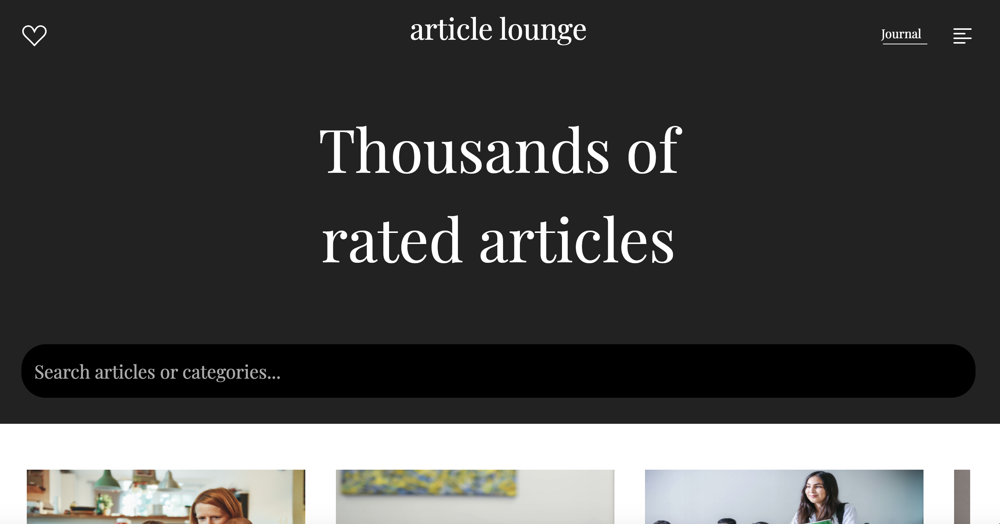
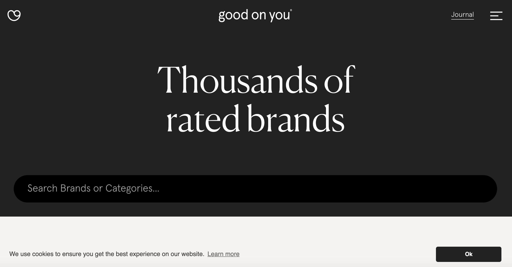
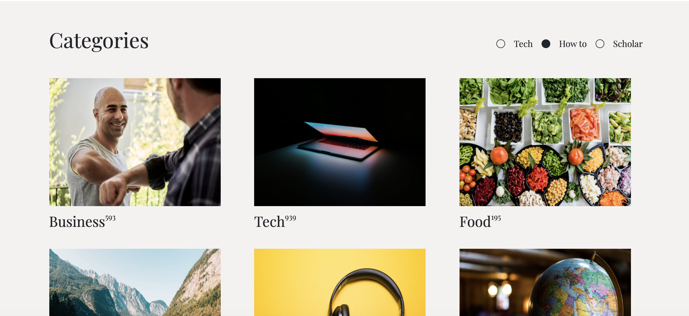

# Article Lounge

## About

Article Lounge is a front end clone of the 'Good on You' brand directory





Can you tell the difference?

This application was built with
```
Ruby on Rails, Javascript, HTML & CSS.
```
## Live site:

[Article Lounge](https://new-article-lounge.herokuapp.com/)

## Setup

If you would like to look at the code then clone the GitHub repository and change directory into `article-lounge-two`:
```
gh repo clone Tom-Tee/article-lounge-two
```

You will also need Bundler installed:
```
bundle install
```
This will install the gems needed to run the program correctly.


I wanted to take a live website with an attractive design and copy it to the best of my ability, while putting my spin on it. The page includes a horizontal scroll as well as some Javascript usage on the button selector. My biggest challenge was creating the “Journal” hover effect on the navbar which I found very unique. The page is fully responsive.




